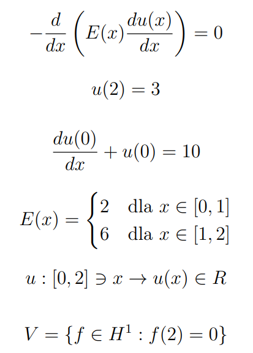

# Finite element method

Algorithm solves differential equation with bounduary conditions using finite element method. It finds elastic deformation of metal for given function with provided by user calculations precision . It was developed at AGH UST for Differential Equations subject. 

# Technologies used

- Python - numpy for calculations, matplotlib for generating charts

# Setup and launch
 - ensure you have installed python on working machine
 - navigate to project directory using cmd
 - execute py main.py
 - enter expected precision
 
Results will show up in separated window and pdf file will be saved in project directory.

# Author
 - Kamil Rudny [krudny](https://github.com/krudny)